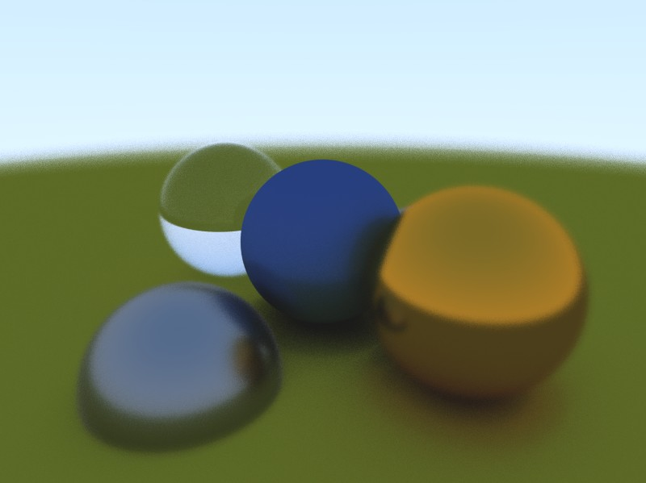

# Simple real-time GLSL path tracer
Based on the book "Ray Tracing in One Weekend" by Peter Shirley.

## Description
**Important!** In order to compile and run the project, you need to modify property file: `vkEngine/PropertySheet.props`. It contains the following line:
```
<VulkanSDKRoot>\VulkanSDK\1.0.61.1</VulkanSDKRoot>
```
which you need to modify to have real Vulkan SDK path.

The pathtracer is written in the GLSL fragment shader, which is applied to the fullscreen quad.
Fullscreen quad is rendered with Vulkan graphics API.

In the supplied scene, you can see effects that could be naturally achieved using pathtracing (contrary to the modern rasterization techniques): antialiasing, depth of field, reflection, refraction, global illumination, etc.



Pathtracer code is in the `vkEngine\shaders\pathtracer.fs` file. Materials are described in the `materialScatterRay` function, the secene is set up in the `hitWorld` function. Camera and DoF settings are in the `main` function.

The sample implements pseudo-random function, but the shader actually receives noise texture as an input, so if you don't like results of the supplied random function, feel free to use the texture.

## License
[Creative Commons Attribution-NonCommercial-ShareAlike 4.0 International Public License](https://creativecommons.org/licenses/by-nc-sa/4.0/legalcode)
